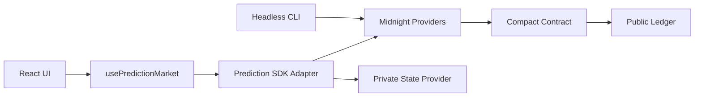

# Design: Private Football Prediction Market

## Boundary Commitments

本仕様は `pkgs/contract` の市場回路、`pkgs/shared` の安定型、`pkgs/cli` の操作、`pkgs/app` のLace接続UI、READMEと検証を所有する。Midnightノード、Indexer、Proof Server、Lace本体、外部オラクルは所有しない。

## Architecture

## Contract

- `MarketPhase`: open, reveal, awaiting_result, resolved。
- `Team`: amber_foxes, cedar_owls, harbor_whales, meadow_bears。
- 参加者IDは `persistentHash(domain, local_secret_key)`。
- deployする端末のprivate stateにあるsecret keyからadmin keyを導出し、constructorでadmin keyを公開ledgerへ固定する。同じ秘密を持つdeploy端末だけが管理回路を実行できる。
- commitmentはparticipant key、team、公開stake、saltをドメイン分離してhash化する。commit時にparticipant key、commitment、stake、総poolだけを公開し、teamとsaltは公開しない。
- reveal時はteamを公開してteam poolへ加算するがsaltは公開しない。commitment一致のZK検証がsaltを知ることだけを証明する。
- 公開ledgerは管理者キー、phase、commitments、stakes、revealed/claimed集合、total pool、4 team pools、winner、rewards、total claimed rewardsを保持する。
- 回路: `commit_prediction`, `close_predictions`, `reveal_prediction`, `close_reveal`, `resolve_market`, `claim_reward`。
- stakeは10〜500。整数配当は切り捨て、各claim後に`total_claimed_rewards <= total_pool`をassertする。winner poolが0のresolveは拒否する。

## TypeScript Boundaries

- contract witnessesはsecret key、team、saltの保存・取得だけを担当する。private state providerがcontract addressとnetworkで永続化し、join時に既存状態を復元する。別端末・private storage消失時は秘密を復元できず、reveal/claim不能であることをUIとREADMEで明示する。
- sharedは生成型をUI向けの `MarketLedgerState` へ変換する契約を持つ。
- app SDK adapterはdeploy/find/callTx/Observable/private-state更新を担当する。
- hookはUI状態機械とエラー復旧、network-scoped storage、subscription lifecycleを担当する。
- CLIは同じ生成Contract/Provider設定を使うheadless reference flowを提供する。

## UI

- 地域サッカーフェス冊子を参照した温かいアイボリー、フォレスト、テラコッタのトークン。
- チームは均等カードでなく順位表風リスト、予測票はチケット風の非対称レイアウト。
- phaseにより操作を一つに絞り、証明生成中の段階を `aria-live` で通知する。
- 管理者操作は管理者判定時のみ表示する。

## File Structure Plan

- `pkgs/contract/src/prediction-market.compact`: 市場の唯一のルール実装。
- `pkgs/contract/src/prediction-market-witnesses.ts`: private state/witness。
- `pkgs/contract/src/test/prediction-market-*.ts`: simulatorと不変条件テスト。
- `pkgs/shared/src/prediction-market-types.ts`: 共有ドメイン型。
- `pkgs/app/src/lib/prediction-market.ts`: SDK adapter。
- `pkgs/app/src/hooks/usePredictionMarket.ts`: UI orchestration。
- `pkgs/app/src/components/PredictionMarket/*`: presentation。
- `pkgs/cli/src/api.ts`, `cli.ts`: headless操作へ移行。
- `README.md`: 再現手順、privacy、architecture、trust model。

## Testing Strategy

- Simulator: 1.1〜3.4の全状態遷移、改ざん、権限、二重操作、winner pool zero、配当上限。
- Hook/UI: 4.3、5.1〜5.4のphase表示と操作ガード。
- Build: 4.1〜4.4、6.1のContract/shared/CLI/app build。
- Fresh clone: 隔離cloneでbun installからcompile/test/buildを実行しproduction previewをsmokeする。
