# Hidden League Forecast

A privacy-preserving, four-outcome football prediction market built with Midnight Compact, Midnight.js, and Lace Wallet.

Players predict which fictional club will win the Lantern Cup. During the open phase the team and salt stay in the browser's Midnight private-state store; only a salted commitment, pseudonymous participant key, and public demo-point stake reach the ledger. Picks are revealed only after predictions close, preventing followers from copying the crowd.

> Educational example only. It uses demo points and a trusted market steward—not real assets or a production oracle.

## Demo

[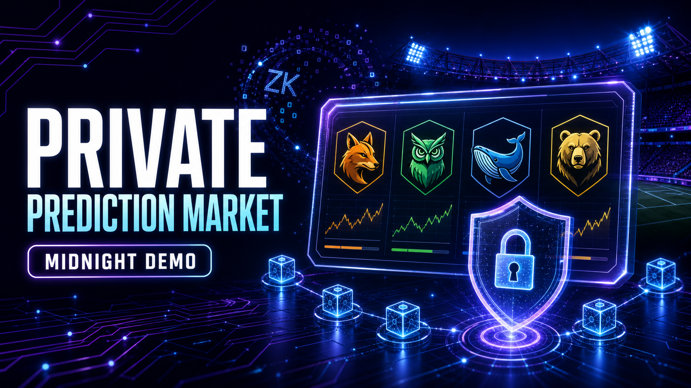](https://youtu.be/G4T-L-rVgzU)

## Screen Shots

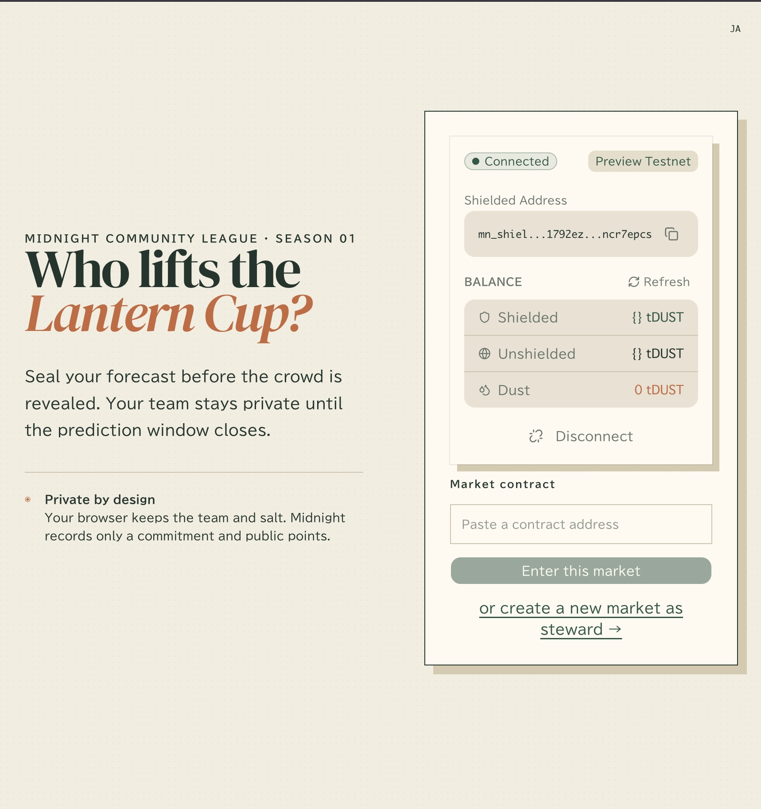


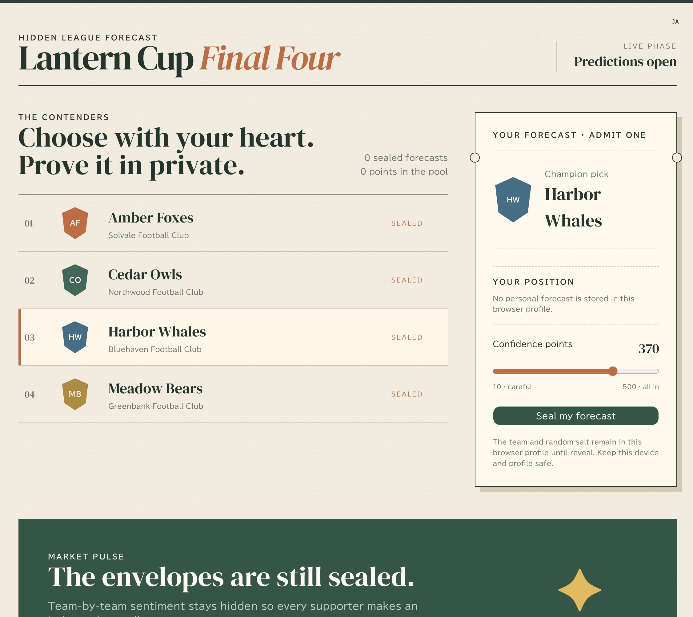


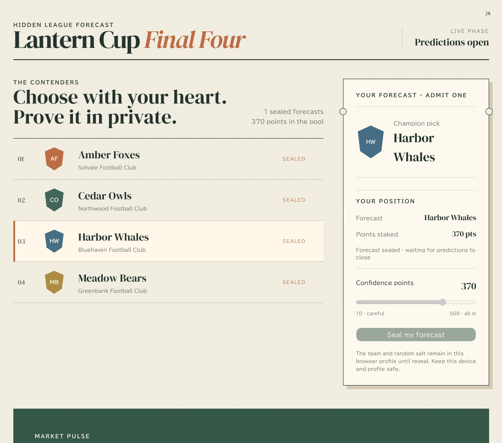

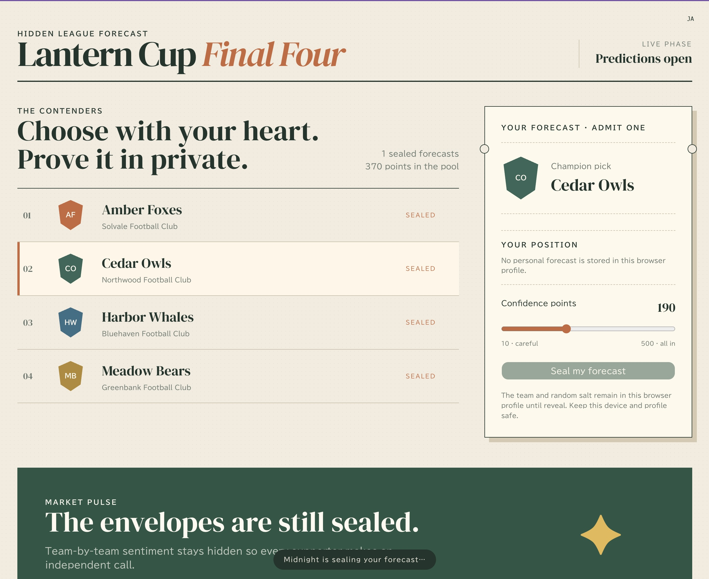

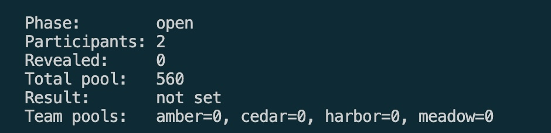

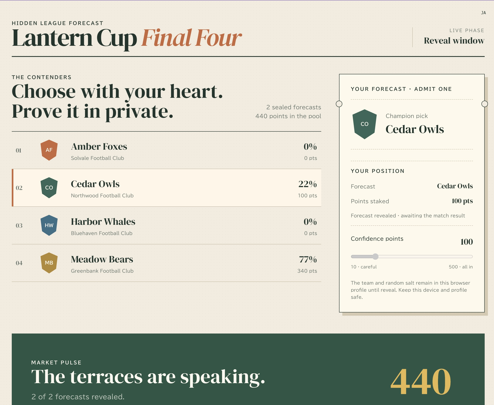

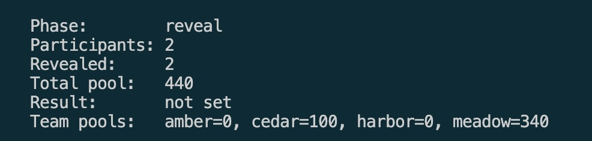

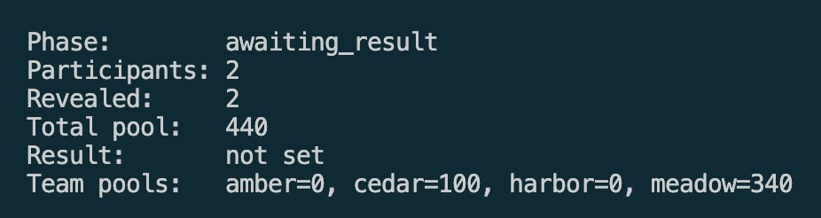

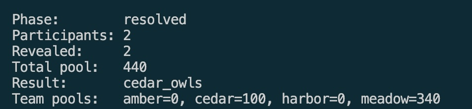

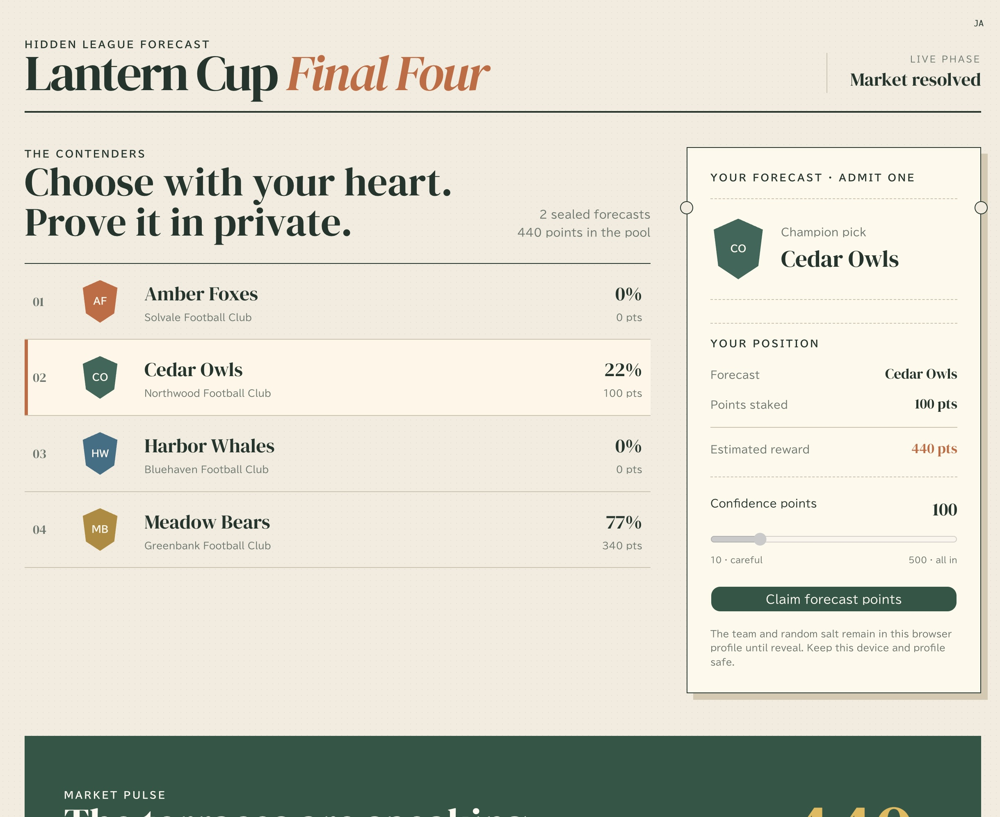

## Market flow

```text
OPEN → REVEAL → AWAITING RESULT → RESOLVED → CLAIM
```

1. Connect Lace and deploy or join a market.
2. Select Amber Foxes, Cedar Owls, Harbor Whales, or Meadow Bears.
3. Commit 10–500 public demo points. The team and salt remain private.
4. The steward closes predictions; participants reveal their committed picks.
5. The steward records the fictional match winner.
6. Correct predictions claim floor-rounded pari-mutuel points:

```text
reward = floor(total pool × player stake / winning-team pool)
```

Compact verifies the caller-provided floor result without division using `r × p ≤ n < (r + 1) × p`, and prevents total claimed rewards from exceeding the pool.

## Privacy model

- `local_secret_key`, selected team, and salt are supplied through Compact witnesses.
- Participant identifiers and commitments are domain-separated persistent hashes.
- Open-phase ledger updates do not disclose the selected team.
- Reveal proves the private team/stake/salt match the earlier commitment before updating a public team pool.
- The secret is browser-profile local. Clearing browser data or changing devices before reveal can make the prediction unrecoverable.

This is meaningful temporary privacy, not permanent anonymity: a successful reveal intentionally publishes the team after the market closes.

## Packages

| Package | Responsibility |
|---|---|
| `pkgs/contract` | Compact contract, witnesses, generated ZK material, simulator tests |
| `pkgs/shared` | Network config and stable prediction-market types |
| `pkgs/cli` | Headless Midnight wallet and network utilities |
| `pkgs/app` | React/Vite UI, Lace integration, providers, contract state subscription |

## System architecture

Hidden League Forecast is a browser-first dApp. It keeps a prediction's team and
salt in the participant's private state, while using Midnight's proving flow to
verify that later reveal and reward-claim transactions match the original
commitment. The same Compact contract can also be driven through the included
headless CLI.

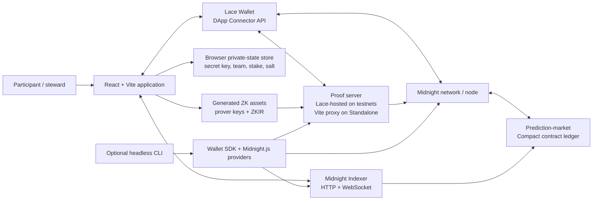

### Transaction and data flow

1. The browser connects to Lace and derives a pseudonymous participant key from
   the local secret witness.
2. When a participant commits, the app writes the selected team, stake, and
   random salt to a network-scoped private-state store. The contract receives
   only the stake, derived key, and a salted commitment hash.
3. Midnight.js obtains the contract's ZK configuration from the versioned
   `public/managed/prediction-market` assets. Lace balances and submits the
   transaction after the proof provider has generated a proof.
4. The app subscribes to public contract state through the Indexer. This drives
   the market phase, public pools, and each wallet's actionable status.
5. During reveal, witnesses supply the locally retained team and salt. Compact
   recomputes the commitment before the selected team is disclosed and its pool
   is updated.
6. On resolution, a winning participant calculates the floor-rounded reward in
   the app; the contract verifies the quotient bounds and pool conservation
   before recording the claim.

### Component responsibilities

| Layer | Key implementation | Responsibility |
|---|---|---|
| Smart contract | `pkgs/contract/src/prediction-market.compact` | Enforces phases, owner authorization, commitment verification, revealed pools, and pari-mutuel reward conservation. |
| Witnesses/private state | `pkgs/contract/src/prediction-market-witnesses.ts`, browser private-state provider | Holds the secret key, selected team, stake, and salt that must never be disclosed during commit. |
| Shared domain package | `pkgs/shared` | Shares network endpoints, ledger types, phase/team enums, and reward math between UI and CLI. |
| Browser providers | `pkgs/app/src/lib/prediction-market-providers.ts` | Adapts Lace's DApp Connector to Midnight.js wallet/midnight providers, and configures private state, Indexer, ZK assets, and proof server access. |
| Browser workflow | `pkgs/app/src/lib/prediction-market.ts`, `pkgs/app/src/hooks/usePredictionMarket.ts` | Deploys or joins a contract, persists a prediction before commit, calls circuits, and subscribes to ledger updates. |
| User interface | `pkgs/app/src/components/PredictionMarket/` | Presents market state and guides participants and the steward through valid next actions. |
| Headless runtime | `pkgs/cli` | Provides Preview, PreProd, and Docker-backed Standalone workflows using the same compiled contract and shared types. |

## Technology stack

| Area | Technology | Version / role |
|---|---|---|
| Smart contract | Midnight Compact + Compact Standard Library | Contract source targets Compact language `>= 0.16 && <= 0.22`; generated artifacts are committed for repeatable browser proving. |
| Contract runtime | `@midnight-ntwrk/compact-js`, `compact-runtime` | `2.5.0` / `0.15.0`; creates the compiled contract instance and runs generated witnesses. |
| Midnight application SDK | Midnight.js contracts, providers, and types | `4.0.4`; deploys/finds contracts, reads public state, supplies proofs, and submits transactions. |
| Wallet integration | Lace + `@midnight-ntwrk/dapp-connector-api` | Connector API `3.x`; supplies network endpoints, balances unsealed transactions, and submits them from the user's wallet. |
| Headless wallet | Midnight Wallet SDK (Facade, HD, Dust, Shielded, Unshielded) | Used by the CLI for non-browser Preview, PreProd, and Standalone operation. |
| Frontend | React + TypeScript + Vite | React `19.2`, TypeScript `~6.0`, Vite `5.4`; browser interface and build pipeline. |
| UI and localization | Tailwind CSS, Radix UI, Lucide, i18next | Tailwind `4`, Radix UI `1.4`, Lucide `1.8`, i18next `26`; accessible components and English/Japanese UI text. |
| State and streams | RxJS + browser local storage | RxJS `7.8` listens for Indexer state updates; a network-scoped store retains the current market address and private-state provider isolates secrets per wallet. |
| Testing and quality | Vitest, Biome, TypeScript | Simulator and hook tests, formatting/linting, and package builds validate contract and application behavior. |
| Local infrastructure | Docker Compose | Runs Midnight node, Indexer, and Proof Server for the Standalone CLI flow. |

### Network-specific provider selection

| Network | Indexer / node | Proof server path | Typical use |
|---|---|---|---|
| Preview | Lace-provided Preview endpoints | CORS-enabled prover URL returned by Lace | Recommended shared browser demo. |
| PreProd | Lace-provided PreProd endpoints | CORS-enabled prover URL returned by Lace | Alternative public test environment. |
| Standalone (`undeployed`) | Local Docker node and Indexer | Vite's same-origin `/proof-server` proxy to local port `6300` | Local CLI smoke test and isolated development. |

The app intentionally uses the proxy only on Standalone: browser service-worker
restrictions can prevent Lace from reaching a loopback proof server directly,
whereas Preview and PreProd already provide a hosted prover through Lace.

## Prerequisites

- **Recommended:** Docker Desktop, VS Code, and the **Dev Containers** extension
- Lace Wallet with Midnight support for browser operation
- The **Preview** network selected in Lace (recommended for this project)

> The repository's Dev Container installs the pinned Bun and Compact toolchain and
> provides Docker access. It is the recommended way to run the project because it
> removes host-specific toolchain differences. Preview is the recommended network
> for browser and multi-participant demos. Use Standalone only for a local CLI
> smoke test.

## Recommended: run with Dev Container on Preview

1. Install Docker Desktop, VS Code, the **Dev Containers** extension, and Lace
   Wallet with Midnight support.
2. Clone this repository in VS Code, then run **Dev Containers: Reopen in
   Container** from the Command Palette. Wait for the `postCreateCommand` to
   finish installing Compact 0.30.0.
3. In Lace, unlock the wallet and select the **Preview** Midnight network.
4. Open a terminal in the Dev Container and run:

```bash
bun install
bun run contract compact
bun run build
bun run dev -- --host 0.0.0.0
```

5. Open the forwarded Vite URL (normally `http://localhost:5173`) in the host
   browser. `--host 0.0.0.0` is required so Vite accepts connections forwarded
   from the Dev Container. In the app, select **Preview Testnet**, connect Lace,
   and deploy a market or join one with a Preview contract address.

Preview uses the HTTPS Proof Server supplied by Lace. Do **not** start a local
Proof Server for the browser app on Preview. Give every participating wallet
Preview tDUST from the [Preview faucet](https://faucet.preview.midnight.network/)
before submitting transactions.

### Run the Preview CLI in Dev Container

Use the same terminal after the build above:

```bash
bun run cli preview
```

Choose a fresh wallet or enter an existing seed when prompted, fund the resulting
Preview address with tDUST, and then deploy or join a market. Each participant
must use a distinct wallet/private-state profile. Keep the network, contract
address, and wallet private state unchanged until the reveal and claim steps are
complete.

## Alternative: run directly on the local machine

If Dev Container is unavailable, install Bun 1.2+, Compact 0.30.0, Docker
Desktop, and Lace Wallet on the host first. Then use the same recommended Preview
workflow:

```bash
bun install
bun run contract compact
bun run build
bun run dev
```

Open the displayed Vite URL, choose **Preview Testnet**, and connect Lace set to
Preview. For the headless CLI, run:

```bash
bun run cli preview
```

As with Dev Container, Preview uses Lace's hosted Proof Server; no local Proof
Server is required for this workflow.

### Local Standalone CLI smoke test

Standalone starts a local node, indexer, and Proof Server, and is useful for a
single-operator smoke test. It is not the recommended path for a shared demo or
multi-participant market:

```bash
bun install
bun run contract compact
bun run build
bun run cli standalone
```

The command manages the local Docker environment for the duration of the CLI
session. Standalone contract addresses and private state are not compatible with
Preview; never reuse them across networks.

## Install, compile, test, build

```bash
bun install
bun run contract compact
bun run test
bun run lint
bun run typecheck
bun run build
```

`bun run contract compact` generates the contract JavaScript, proving/verifier keys, and ZKIR from `pkgs/contract/src/prediction-market.compact`. Do not hand-edit `src/managed`.

## Browser app network notes

The browser app supports Preview, PreProd, and Standalone. Prefer **Preview** for
normal development and demonstrations. Lace must use the same network as the app;
contract addresses and private state are network-specific.

For Standalone only, proof requests use the Vite same-origin `/proof-server` proxy
because Lace's service worker can block direct browser requests to
`127.0.0.1:6300`. Preview and PreProd use the hosted Proof Server returned by Lace.

## Network helpers

```bash
bun run cli preview      # recommended public testnet workflow
bun run cli preprod      # alternative public testnet workflow
bun run cli standalone   # local node, indexer, proof server, and headless client
```

`preview-ps` and `preprod-ps` are available for CLI compatibility scenarios that
explicitly need a local Proof Server. They are not required for the recommended
browser workflow. Preview and PreProd need funded wallet credentials and matching
network services. Contract addresses and private stores are scoped by network so
secrets cannot leak between environments.

## Operating a market safely

The headless CLI follows the same contract lifecycle as the browser app. Compile and build before operating a market so that the generated contract, ZK keys, and browser assets agree:

```bash
bun install
bun run contract compact
bun run build
bun run cli standalone
```

`bun run cli standalone` starts a local node, indexer, proof server, and one headless CLI. It uses the built-in genesis wallet and stops the Docker environment when the CLI exits, so treat it as a single-operator smoke test—not a multi-participant rehearsal. For independent participants, use separately funded wallets on Preview/Preprod with a shared, persistent network.

Select **Deploy a new prediction market** to create a market. The deploying wallet becomes its steward; copy the displayed contract address so participants can select **Join an existing prediction market** on the same network. A contract address is scoped to its network: never reuse an address or generated artifact from Standalone, Preview, Preprod, or the retired RPS contract on another network.

Use the following sequence. The steward controls the market transitions, while each participant controls only their own prediction and claim.

| Step | Actor | CLI action | Check before continuing |
|---|---|---|---|
| 1 | Steward | Deploy a new prediction market | Save the contract address. |
| 2 | Each participant | Commit a prediction | Choose a team and stake 10–500 demo points. A participant can commit only once. |
| 3 | Steward | Close predictions | Do this only after all intended commits have finalized. |
| 4 | Each participant | Reveal my prediction | Use the same wallet and browser profile that made the commitment. |
| 5 | Steward | Show market state | Confirm `Revealed` matches the number of predictions that should participate, and inspect `Team pools`. |
| 6 | Steward | Close reveal | Only close after every intended reveal in step 4 is complete. |
| 7 | Steward | Resolve market | Select a team whose value in `Team pools` is greater than zero. |
| 8 | Each winning participant | Claim reward | The CLI calculates and submits the floor-rounded pari-mutuel reward. |

### Important operating constraints

- The phases are one-way: `open → reveal → awaiting_result → resolved`. There is no cancel or rewind operation.
- Do **not** select **Close reveal** while `Revealed` is zero or before the expected reveals have completed. With no revealed team pool, no winner can be resolved and that market address cannot be recovered; deploy a new market instead.
- A prediction commitment is bound to private browser/CLI state. Clearing the browser profile, switching wallet/profile, or losing that state before reveal prevents that participant from revealing or claiming.
- Participants need distinct wallets and private-state profiles. Do not share seed phrases, browser/LevelDB private-state stores, selected teams, salts, or secret keys.
- Use **Show market state** before every steward transition. It reports phase, participant/reveal counts, total pool, and each team pool.
- A commit publicly records a pseudonymous participant key, commitment, and stake. It hides only the team and salt until the participant reveals; revealing intentionally makes the team public.
- An unrevealed commitment remains in `total_pool` but not in a team pool. That participant cannot claim, while revealed winners may receive a larger calculated reward. Announce a reveal deadline before closing the reveal phase.
- Claims record demo-point accounting only; they do not transfer a real asset.

For Preview or Preprod, use the matching `bun run cli preview-ps` or `bun run cli preprod-ps` command instead. Fund each wallet, wait for DUST and transaction finalization, and keep every participant on the same network and proof-server configuration as the deployed contract. Never hand-edit `src/managed`.

## Verification

The Compact simulator creates independent private states for several players while sharing one public ledger. Tests cover:

- open-phase team privacy and public stake accounting
- duplicate/out-of-range commits
- administrator authentication and one-way phase transitions
- uncommitted, duplicate, and modified-secret reveal attempts
- zero winning-pool resolution rejection
- losing, early, incorrect, and duplicate claims
- multiple-winner floor rounding and reward conservation

Before submission, clone the repository into a clean directory and repeat the complete install/compile/test/build sequence. Then run the production artifact with `bun run app preview` and complete one deploy → commit → reveal → resolve → claim flow using separate browser profiles.

## Trust and production limitations

- The deploying browser is a trusted steward and resolves the winner.
- There is no dispute window, external oracle, real collateral, secondary trading, or permissionless market creation.
- A production market should use a multisig or optimistic oracle, explicit deadlines, asset custody rules, and an audit.

## Deployed Contract Info

```bash
──────────────────────────────────────────────────────────────
  Prediction Market Actions    DUST: 160,771,839,999,999,997
  Contract: 660dc040ba8c6d6c4619f0233b1f97ad366bc5fbb793fbdd1522e1368a3f82c3
──────────────────────────────────────────────────────────────
```

## Contract Demo

```bash
──────────────────────────────────────────────────────────────
  ✓ Dust tokens already available (731,730,909,999,999,993 DUST)
  ✓ Configuring prediction-market providers

──────────────────────────────────────────────────────────────
  Prediction Market Setup     DUST: 731,730,909,999,999,993
──────────────────────────────────────────────────────────────
  [1] Deploy a new prediction market
  [2] Join an existing prediction market
  [3] Monitor DUST balance
  [4] Exit
──────────────────────────────────────────────────────────────
> 1
[12:44:15.538] INFO (37812): Deploying prediction-market contract...
  ⠇ Deploying prediction market[12:44:42.362] INFO (37812): Deployed prediction-market contract at: 71881e3a61479ce137d85fe01e50062a11d84fc290b9f6d9f686c70450734813
  ✓ Deploying prediction market
  Contract deployed at: 71881e3a61479ce137d85fe01e50062a11d84fc290b9f6d9f686c70450734813


──────────────────────────────────────────────────────────────
  Prediction Market Actions    DUST: 733,249,649,999,999,992
  Contract: 71881e3a61479ce137d85fe01e50062a11d84fc290b9f6d9f686c70450734813
──────────────────────────────────────────────────────────────
  [1] Commit a prediction
  [2] Reveal my prediction
  [3] Show market state
  [4] Close predictions (steward)
  [5] Close reveal (steward)
  [6] Resolve market (steward)
  [7] Claim reward
  [8] Exit
──────────────────────────────────────────────────────────────
──────────────────────────────────────────────────────────────
> 1

──────────────────────────────────────────────────────────────
  Select a team
──────────────────────────────────────────────────────────────
  [1] Amber Foxes
  [2] Cedar Owls
  [3] Harbor Whales
  [4] Meadow Bears
──────────────────────────────────────────────────────────────
> 1
Stake (10–500 demo points): 400

  ⠇ Committing prediction — generating ZK proof[12:45:33.585] INFO (37812): Commit TX 003c6bbffe9cafb83f8fe7e6e8cea76157c4a5b481d11f1d69981b2d72a68996c1 added in block 84754
  ✓ Committing prediction — generating ZK proof

──────────────────────────────────────────────────────────────
  Prediction Market Actions    DUST: 735,057,734,999,999,991
  Contract: 71881e3a61479ce137d85fe01e50062a11d84fc290b9f6d9f686c70450734813
──────────────────────────────────────────────────────────────

──────────────────────────────────────────────────────────────
> 3
[12:45:51.735] INFO (37812): Checking prediction-market ledger state...
[12:45:53.502] INFO (37812): Prediction-market state: {"phase":0,"admin_key":"0xf747ea03...","participant_count":"1","revealed_count":"0","total_pool":"400","amber_foxes_pool":"0","cedar_owls_pool":"0","harbor_whales_pool":"0","meadow_bears_pool":"0","winning_team":0,"result_set":false,"total_claimed_rewards":"0","commitments":{},"stakes":{},"participants":{},"revealed":{},"claimed":{},"rewards":{}}


  Phase:        reveal
  Participants: 1
  Revealed:     1
  Total pool:   300
  Result:       not set
  Team pools:   amber=300, cedar=0, harbor=0, meadow=0

> 4
✓ Closing predictions

──────────────────────────────────────────────────────────────
  Prediction Market Actions    DUST: 737,485,844,999,999,990
  Contract: 71881e3a61479ce137d85fe01e50062a11d84fc290b9f6d9f686c70450734813
──────────────────────────────────────────────────────────────

> 5
  ✓ Closing reveal

──────────────────────────────────────────────────────────────
  Prediction Market Actions    DUST: 738,963,249,999,999,989
  Contract: 71881e3a61479ce137d85fe01e50062a11d84fc290b9f6d9f686c70450734813
──────────────────────────────────────────────────────────────

6

──────────────────────────────────────────────────────────────
  Select a team
──────────────────────────────────────────────────────────────
  [1] Amber Foxes
  [2] Cedar Owls
  [3] Harbor Whales
  [4] Meadow Bears
──────────────────────────────────────────────────────────────
  ⠙ Resolving market1
  ✓ Resolving market

──────────────────────────────────────────────────────────────
  Prediction Market Actions    DUST: 822,437,354,999,999,983
  Contract: 660dc040ba8c6d6c4619f0233b1f97ad366bc5fbb793fbdd1522e1368a3f82c3
──────────────────────────────────────────────────────────────

 ✓ Claiming floor-rounded reward

──────────────────────────────────────────────────────────────
  Prediction Market Actions    DUST: 825,113,474,999,999,982
  Contract: 660dc040ba8c6d6c4619f0233b1f97ad366bc5fbb793fbdd1522e1368a3f82c3
──────────────────────────────────────────────────────────────

>3

  Phase:        resolved
  Participants: 1
  Revealed:     1
  Total pool:   300
  Result:       amber_foxes
  Team pools:   amber=300, cedar=0, harbor=0, meadow=0
```
